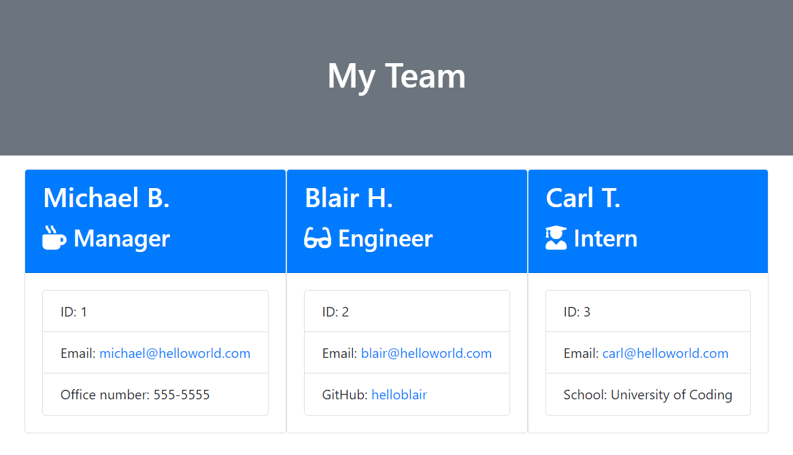
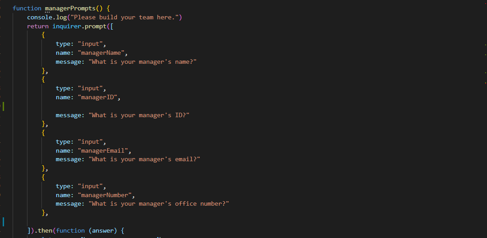
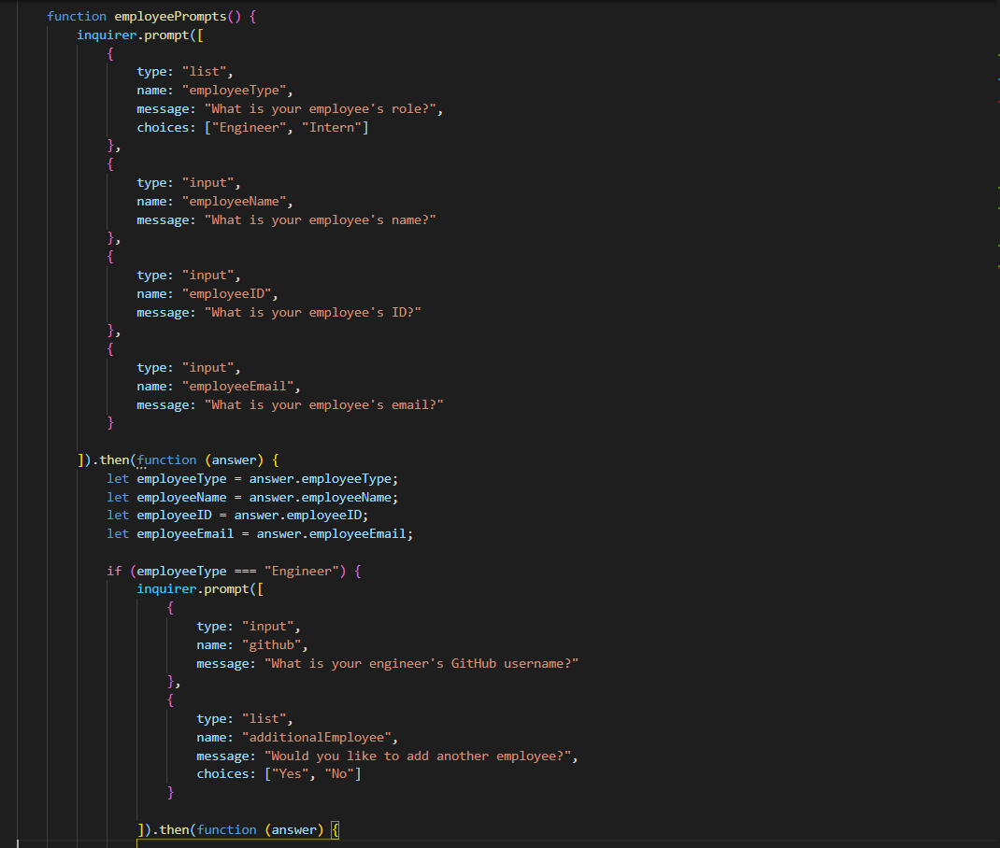
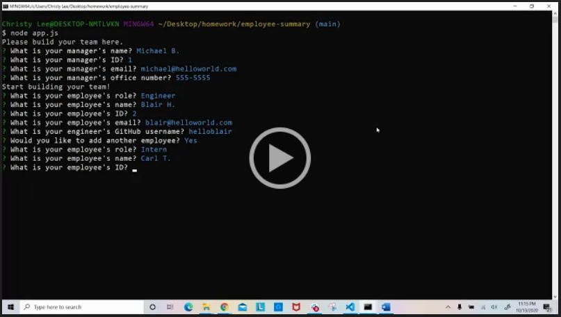

# Employee Summary
This employee summary is a Node CLI application that takes in information about employees and generates an HTML webpage that displays summaries for each person. 

 

The application will prompt the user for information about the team manager and then information about the team members. The user can input any number of team members, and they may be a mix of engineers and interns. When the user has completed building the team, the application will create an HTML file that displays a nicely formatted team roster based on the information provided by the user. 

 

## Coding Process

Each employee type (manager, engineer, or intern) had slightly different information. In order to write my code to ask different questions without repeating code via inquirer, I had to separate out manager prompts from employee prompts and include if/else statements.

 

 

To view the demo of this application, please navigate to the **Demo Link** below or  [click here](https://drive.google.com/file/d/1xYPoTutEGbWFlKxCVmbB60WNB-zJGCDh/view) to view.

 

## Powered By

* [Javascript](https://developer.mozilla.org/en-US/docs/Web/JavaScript)
* [Node.js](https://nodejs.org/en/)
* [npm install](https://nodejs.org/en/)
* [inquirer nodejs](https://www.npmjs.com/package/inquirer)
* [jest nodejs](https://www.npmjs.com/package/jest)

 

### Other Resources Used

* [Visual Studio Code](https://code.visualstudio.com/)
    * [How to install VS Code](https://code.visualstudio.com/docs/setup/setup-overview)
* [GitBash](https://gitforwindows.org/)
    * [Download GitBash for Windows](https://git-scm.com/downloads)

 

## Demo Link

* [See Demo Link](https://drive.google.com/file/d/1xYPoTutEGbWFlKxCVmbB60WNB-zJGCDh/view)

 

## Author
**Christy Lee** 

- [Github](https://github.com/christyglee)
- [LinkedIn](https://www.linkedin.com/in/christy-g-lee/)

  

## Acknowledgments

* [Google-Fu](https://www.google.com)
* [w3schools](https://www.w3schools.com/)
* [Stack Overflow](https://stackoverflow.com/search?q=over)
* [Node.js](https://nodejs.org/en/)
* [npm install](https://nodejs.org/en/)